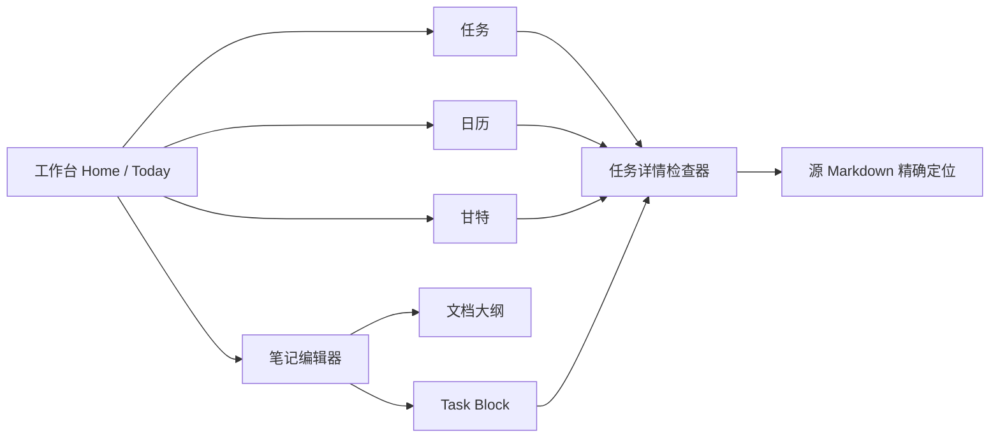

# md-workspace 产品规格 v1：可信 Markdown 工作台

> **状态：实施前产品/信息架构基线**  
> **版本：v1.0-draft（2026-07-20）**  
> **适用范围：权威源码 `work/md-workspace` 的下一轮核心重构与全新 UI。**  
> 任务语言以 [`task-language.md`](./task-language.md) 为准；本文件定义产品行为、信息架构、交互、验收和实施优先级。

---

## 0. 决策摘要

md-workspace 不是“把 Markdown 每一行 checkbox 列出来”的工具，而是一个让用户**在 Markdown 中显式声明可管理工作**、再在多个工作视图中可靠操作的本地工作台。

### 本版本必须达成的决定

1. **Markdown 是唯一真源；Task Block 是唯一任务授权范围。** 普通文档、引用、代码样例和普通 checklist 都不投影。
2. **只读时绝不改文件。** 扫描、打开、切换视图和索引不能补 ID、套容器、重排格式或创建“本周计划”。
3. **Todo、Calendar、Gantt 使用同一棵任务树与同一日期语义。** 不允许三个组件各自解析 Markdown 或偷偷把 `due` 当 `end`。
4. **新任务必须有目标 Task Block。** 没有有效 Block 时，用户先决定插入位置/创建 Block；应用不能默认把任务追加到文档末尾。
5. **反向编辑是带版本校验的最小文本补丁。** 操作只改所选 token；冲突、重复 ID、解析 error 时宁可阻断也不猜测写入。
6. **默认首页是 Today/工作台，而不是用户并未要求的“本周计划”。** 用户文档标题永远是用户内容；初次使用也不创建示例笔记。
7. **UI 全新采用“墨线工作台（Ink Ledger）”方向。** 以一个统一的“工作线”（状态、色彩、日期、层级）贯穿编辑器、任务树、日历和甘特，而非四个拼接页面。

---

## 1. 当前产品审查（As-is）

下表基于当前权威源码的任务核心、工作区状态和三个视图审查。这里列出的是产品风险，不是对用户行为的假设。

| 编号 | 当前表现 | 用户影响 | 严重度 | v1 决策 |
|---|---|---|---|---|
| P-01 | 解析器逐行匹配 `- [ ]`，没有 Task Block 边界 | 随手 checklist、README、代码示例会污染 Todo/Gantt/Calendar | P0 | 仅 Task Block 内合法任务行入库 |
| P-02 | 仅支持 `- [ ]`，并且缺乏 fenced code / 引用边界 | Markdown 兼容性低，文档示例可能成为任务 | P0 | 支持 `-/*/+`，排除代码/引用/frontmatter |
| P-03 | `@due` 被折叠到 `end` | 截止日被错误显示为执行期；回写可能语义变形 | P0 | date/due/start/end 分离建模和回写 |
| P-04 | 打开旧文档自动 `ensureTaskIds` 并落盘 | 用户未操作就发生文件变更，可能触发同步/版本噪音 | P0 | 打开和扫描完全只读；迁移须显式确认 |
| P-05 | 回写会整行序列化，清洗未知 metadata | 格式、未知扩展、`@due` 和用户习惯可能丢失 | P0 | token 级最小补丁；未知内容原样保留 |
| P-06 | 任务 ID 缺失时以行号/标题 hash 兜底，重复 ID 缺少安全门 | 移动或改标题后可能定位错误、误改另一条 | P0 | 新任务才生成 id；重复 ID 阻断回写 |
| P-07 | 任务是扁平数组，标题和缩进没有领域含义 | 无法表达项目→阶段→任务的粗细粒度，也无法一致分组 | P0 | Task AST 记录 headingPath、parent/children、depth/type |
| P-08 | “无日期未完成”被归入 Today | Inbox 被误报为今天必须做，工作流失真 | P0 | Inbox、Today、Upcoming 分开 |
| P-09 | UTC / `toISOString()` 与本地日历混用风险 | 跨午夜、东八区会把任务归到错误日期 | P0 | 只使用 LocalDate 语义与本地日历工具函数 |
| P-10 | 甘特以“有 start/end”为近似条件，日期反向时容错排序 | 反向任务被悄悄画成正常条，用户难以发现源文档错误 | P0 | 仅严格合法 `start < end` 出条；错误可见 |
| P-11 | 日历把所有排期当同一种“发生日” | 截止、单日、跨日和里程碑无法一眼区分 | P0 | 四种日期 token 有专属视觉与交互 |
| P-12 | 三个视图有各自筛选/更新规则 | 从一个视图改完，另一个视图可能不一致或刷新延迟 | P0 | 单一 Task Store / 单一写回通道 |
| P-13 | 编辑器 WYSIWYG 使用 HTML 往返，缺少可信 sanitization / 保真边界 | XSS 与 Markdown 结构丢失风险 | P0 | HTML 白名单净化；复杂文档安全降级至源码模式 |
| P-14 | 当前首次体验与默认内容会引入“本周计划” | 用户感觉被模板绑架，纯笔记用户被迫进入任务模式 | P1（但首次体验 P0 验收） | Home 空态引导，不创建/改写任何笔记 |
| P-15 | 新建、删除、移动、失败/冲突等操作缺少统一确认模型 | 用户不知道范围、无法安全撤销 | P1 | 统一任务详情、确认、Undo、冲突面板 |
| P-16 | 键盘能力、快捷键发现和屏幕阅读器语义不完整 | 高频写作和无鼠标/辅助技术用户不可用 | P1 | 命令面板、快捷键表、ARIA 与焦点规范 |
| P-17 | 视图样式彼此割裂，首屏没有明确工作上下文 | UI 像粗糙功能集合，不能建立稳定认知模型 | P1 | Ink Ledger 统一导航、任务线、检查器与设计 token |

### 1.1 不能以“测试通过”掩盖的差距

现有 `test:core` 和构建通过只能证明旧 API 自洽，不能证明上述产品语义正确。尤其“打开时自动补 id”“任何 `- [ ]` 都进入任务”“due 被当 end”虽然可能有测试覆盖，却与 v1 产品合同相冲突；相应旧测试必须在实现阶段替换或重写。

---

## 2. 用户、任务与信息架构

### 2.1 核心使用模式

| 用户模式 | 首要目标 | 主要入口 | 不应被打扰的事项 |
|---|---|---|---|
| 纯写作者 | 写、查、组织 Markdown | Editor / Notes | 普通 checkbox 被转为任务、强制创建计划 |
| 个人执行者 | 把明确计划转成今日行动 | Home / Todo | Inbox 被假定为 Today、无目标 Block 的快速添加 |
| 项目规划者 | 用粗粒度阶段和细粒度工作排期 | Gantt / Task Inspector | 里程碑和截止日期被画成普通区间 |
| 时间回顾者 | 浏览某天/周有哪些执行与截止 | Calendar | 跨日项目被拆散、截止标记被忽略 |
| 多编辑器用户 | 在外部编辑器改 Markdown 后继续管理 | 所有视图 | 自动格式化、未检测的外部修改覆盖 |

### 2.2 导航层级



全局布局（桌面）为三栏可收缩结构：

1. **左栏：导航与笔记库**：Home、Notes、Tasks、Calendar、Gantt；文件夹/搜索/最近文档；不得把任务块伪装成文件夹。
2. **主栏：当前工作面**：Today、编辑器、Todo、Calendar 或 Gantt，顶部显示清晰的页面标题、范围和视图控制。
3. **右栏：上下文检查器**：当前任务详情、来源文档/Block、日期、属性、层级、诊断；无选中任务时显示文档大纲或快捷操作。

窄屏：左栏与右栏均变为带焦点陷阱的抽屉；主栏保持单列。拖拽是增强能力，不得成为唯一编辑路径。

### 2.3 页面与职责

| 页面 | 一句话职责 | 数据范围 | 主操作 | 不负责 |
|---|---|---|---|---|
| Home / Today | 回答“今天应该关注什么？” | 同一 Task Index 的今日、逾期、临近、Inbox 摘要 | 完成、打开详情、进入源文档 | 自动创建计划、把 Inbox 强行排到今天 |
| Editor | 原样写作、阅读、局部创建任务 | 单篇 Markdown 与其诊断 | 编辑源码/受控富文本、插入 Block/任务、定位 | 将普通文档自动任务化 |
| Todo | 对任务树做可执行排序与筛选 | 所有有效 Block 的任务 | 完成、筛选、编辑属性、移动/删除 | 用无日期任务替代 Today |
| Calendar | 以日期解释执行、截止、里程碑 | 有正确日期语义的任务 | 切月/周、选日、编辑日期、定位源 | 把 due 当 duration |
| Gantt | 以区间解释项目排期与并行关系 | 合法跨日区间及里程碑 | 缩放、选择、拖动/调整区间、折叠组 | 渲染单日/仅截止任务为假条 |
| Search / Command | 快速跳转、命令和发现功能 | 文件、标题、任务、命令 | 搜索/执行 | 隐藏危险写操作确认 |

---

## 3. 领域对象与投影合同

### 3.1 统一任务对象

实现应以 `Task` / `TaskBlock` / `Diagnostic` 领域对象为唯一消费层，而不是让 Vue 视图重新 regex Markdown。最低字段为：

```ts
type TaskType = 'group' | 'task' | 'milestone'
type LocalDate = string // 已严格验证的 YYYY-MM-DD

type Task = {
  id: string
  blockId: string
  notePath: string
  sourceRange: { startLine: number; endLine: number; startOffset?: number; endOffset?: number }
  headingPath: string[]
  parentId?: string
  childIds: string[]
  depth: number
  title: string
  done: boolean
  type: TaskType
  date?: LocalDate
  due?: LocalDate
  start?: LocalDate
  end?: LocalDate
  priority?: 'low' | 'medium' | 'high' | 'urgent'
  color?: 'gray' | 'blue' | 'green' | 'orange' | 'red' | 'violet'
  tags: string[]
  editable: boolean
  diagnostics: Diagnostic[]
}
```

`editable = false` 的典型来源是重复任务 ID、失效 Block、源范围失配或结构错误。视图仍可说明问题和打开源文档，但所有破坏性或写入性控件必须禁用并给出原因。

### 3.2 日期投影规则

| 日期语义 | Todo | Calendar | Gantt | 任务详情文案 |
|---|---|---|---|---|
| 无日期 | Inbox；可按 priority 排序 | 不显示 | 不显示 | “未排期” |
| `date` | Today / Upcoming / All | 单日实心任务点 | 不显示 | “安排于 7 月 21 日” |
| `due` | 今天到期、即将到期、逾期 | 空心截止标记 / 旗标 | 不显示 | “截止于 7 月 23 日” |
| `start + end` | 活跃、即将开始、已结束 | 连续跨日条（含首尾日） | 横向区间条 | “执行：7 月 20–24 日” |
| `milestone + date` | 任务和关键节点 | 菱形 | 菱形 | “里程碑：7 月 24 日” |
| `due + start/end` | 两种状态都可筛选 | 条上/旁独立截止标记 | 区间条，详情显示 due | “执行…；截止…” |

所有“今天”“逾期”“本周”均按用户设备的本地日历日计算，不按 UTC 字符串切换。日期排序使用 LocalDate 比较函数，并且在夏令时/跨午夜测试中保持稳定。

### 3.3 任务状态与派生分组

| Todo 分组 | 准入条件 | 默认顺序 | 说明 |
|---|---|---|---|
| Overdue | 未完成且 `due < today`；或区间 `end < today`（可单独显示“排期滞后”） | urgent/high、最早日期、文档顺序 | due 与排期逾期在视觉上区分 |
| Today | 未完成且 `date = today`，或 `start <= today <= end`，或 `due = today` | priority、结束/截止、文档顺序 | 仅时间语义命中，不含 Inbox |
| Upcoming | 未来 7/14/30 日可配置范围内的 date/start/due | 最近日期、priority | 让用户看未来承诺 |
| Inbox | 未完成且无任何完整时间语义 | priority、创建/文档顺序 | 待澄清/待排期，不代表今天 |
| Completed | 已完成任务 | 最近完成/文档顺序 | 默认折叠，用户可展开 |
| All | 所有有效任务，保留树上下文 | 文档/Block/树顺序 | 搜索与批量查看 |

完成任务不会消失，只是默认弱化/折叠；用户必须能筛选“显示已完成”。未完成子项的父 group 显示进度而不是被错误自动完成。

---

## 4. 关键用户流程与交互规格

### 4.1 首次使用与空态

**禁止行为**：首次启动创建或打开名为“本周计划”“今日计划”的笔记；打开任意文档时修改内容。

| 情况 | 主界面 | 主 CTA | 次 CTA | 不应做 |
|---|---|---|---|---|
| 尚未选择笔记根目录 | “选择你的 Markdown 工作区” | 选择文件夹 | 查看本地文件规则 | 生成示例文件 |
| 根目录为空 | “这里还没有笔记” | 新建空白 Markdown | 导入/打开已有文件夹 | 添加任务模板 |
| 有笔记但没有 Task Block | Home 显示“尚未声明可管理任务” | 在当前笔记插入任务块 | 了解 Task Block | 把普通 checkbox 汇入 Todo |
| 有 Task Block 但无任务 | 显示 Block 名称和可添加入口 | 新建任务 | 在编辑器中打开该块 | 虚构“本周计划”标题 |
| 只有 Inbox | Home 明确说明“未排期任务” | 查看 Inbox / 选择排期 | 创建单日任务 | 自动分配为今天 |

### 4.2 在编辑器创建任务

1. 用户触发“新任务”（工具栏、命令面板或快捷键）。
2. 如果光标在有效 Task Block 的合法位置：在当前列表级别插入一个带新 `@id` 的 checkbox；焦点进入标题编辑。
3. 若光标不在有效 Block：打开 **目标 Task Block 选择器**，显示 `文档名 / Block 名 / headingPath / color`，可搜索。
4. 用户可选择“在当前位置插入新 Task Block”，预览将新增的两条注释及默认 Block id/name；确认后插入。
5. 提交任务时最少要求非空标题；日期/类型/priority 均可后补。创建成功后切换到需要的视图时应可定位到同一 `id`。

目标选择器的默认值可以是“当前文档最近使用的 Block”，但必须显式显示，且用户可更改；不能无提示写到其他文档/Block。

### 4.3 任务详情检查器（所有视图共用）

选中任一任务后，右栏显示：

- checkbox、标题、任务类型、父任务与子项进度；
- 来源：笔记名称、Block 名称、headingPath、源行号；“在源码中打开”按钮；
- 日期区：`执行日`、`截止日`、`开始日`、`结束日` 彼此独立控件；类型变化时给出需要字段提示；
- priority、颜色、tags；颜色须同时以文字名称/图标说明；
- 诊断区域：原始 token、影响、修复建议；
- 危险动作：删除、移动，均有明确范围和可取消确认。

编辑任意字段时采用一次明确的最小补丁。保存成功显示非打扰性 toast（含“撤销”）；保存失败保持编辑草稿，不把失败结果写进投影。

### 4.4 Todo 交互

- 支持 `Today / Upcoming / Inbox / Completed / All` 固定分段；保存当前筛选到会话，URL/内部状态可恢复。
- 额外筛选：Block、笔记、tag、priority、type、完成状态、是否有诊断。筛选条件可见、可移除、可清空。
- 默认显示树形上下文：命中子任务时可显示其父路径；用户可切换“仅匹配项”而不会丢失来源。
- 单击打开检查器，双击/Enter 打开源文档并定位。Space 切换完成；若对象不可编辑则说明原因。
- 新建任务按钮始终显示写入目标（或打开目标选择器）。批量完成/删除属于 P2，v1 不应做未经确认的大范围写入。

### 4.5 Calendar 交互

**必需视图**：月视图和周视图；默认月视图，用户选择日期后打开右侧日详情。日历格使用本地周起始设置（默认周一，可在偏好中修改）。

- 单日任务：带 checkbox 和标题的点/卡；同日多项按优先级、文档顺序排列。
- 截止任务：使用旗标/空心图标并显示“截止”文字或可读 label；不能与执行日混同。
- 跨日任务：连续条跨越每个日期格，颜色来自工作线；小屏可折叠为首日卡 + “持续至 …”。
- 里程碑：菱形点，并带可读文字“里程碑”。
- 每格最多显示固定数量（建议 3），其余通过“+N 项”进入该日详情；不能悄悄隐藏。
- 点击任务打开同一详情检查器；拖动单日任务改变 `@date`，拖动区间整体平移 `@start/@end`，调整区间边缘只改对应端点。截止标记拖动只改 `@due`。
- 拖动前后均显示日期预览；落点造成反向区间/语义冲突时拒绝落下并说明原因。键盘替代见第 6 节。

### 4.6 Gantt 交互

**准入**：只显示严格合法的跨日 `@start + @end` task/group，以及 `milestone + @date`。仅 date、仅 due、无日期、不完整日期、反向日期不画成条；它们可在“未纳入甘特”说明中定位。

- 左侧固定树列：可折叠 Block → heading/parent group → task，展示标题、进度、来源提示；右侧时间网格与之垂直对齐。
- 缩放：Day / Week / Month 三档；默认 Week。缩放不会修改数据。
- 条形：颜色、完成弱化、priority 辅助图标、hover/键盘 focus 显示开始/结束/截止/来源。颜色不应遮蔽文字对比度。
- group：可作为没有日期的分组行；如果自身有区间则显示汇总条，但不从子项自动推算和写回日期。
- milestone：菱形而非一日宽的普通条。
- “今天线”：高对比垂直线，附带非颜色文本/aria label。
- 鼠标拖动整条平移（等长修改 start/end），拖左右端调整相应端点；每次操作只影响选中任务。必须有键盘“向前/后移一天、延长/缩短一天”替代。
- 任何排期改动都要经过源版本校验，成功后 Calendar、Todo 立即以同一 Task Store 更新。

### 4.7 删除、移动、撤销

| 操作 | 前置 | 确认内容 | 写入范围 | 撤销 |
|---|---|---|---|---|
| 完成/取消完成 | 任务可编辑 | 有未完成子项时提醒 | 单一 checkbox 字符 | 可撤销 |
| 修改属性 | Task/Block 无 error | 显示字段名称和新值 | 单一 metadata token | 可撤销 |
| 删除本项 | 有子项时必须选择策略 | 仅本项 / 含子项 / 取消 | 精确行或树范围 | 可撤销 |
| 移动任务 | 源/目标 Block 均有效 | 展示源与目标 Block | 移动任务文本及必要缩进 | 可撤销 |
| 迁移旧 checklist | 用户明确选范围 | 显示全文 diff | 注释与 id 的最小插入 | 可撤销 |

Undo 必须基于刚刚成功保存的反向补丁，并再次做版本检查；外部文件已变化时不得强行回滚，改为显示冲突提示。

---

## 5. Markdown 编辑器的产品边界

### 5.1 源码优先和所见即所得

- **源码模式**是完全保真的控制面：所有 Task Block 注释、未知 metadata、复杂 Markdown 结构都可见可编辑。
- WYSIWYG 是受控便利层，不应承诺对任意 Markdown 的无损往返。遇到原始 HTML、嵌入、复杂表格、未识别 task metadata 或净化后差异时，显示“此段建议在源码模式编辑”，并提供定位，而不是静默丢内容。
- 从 Markdown 转 HTML 前和插入到 `innerHTML` 前必须使用严格白名单 sanitization；`script`、事件属性、`javascript:` URL、危险 SVG/HTML 均不得执行。
- 保存前若 WYSIWYG 转换会造成非任务结构差异，展示 diff/确认或拒绝保存，不能无提示覆盖。

### 5.2 编辑器基础 Markdown 功能（成熟产品基线）

| 能力 | 行为要求 | 快捷入口 |
|---|---|---|
| 标题/段落 | H1–H6、段落、引用、分隔线；按 Markdown 标准 | 工具栏、命令面板、`Ctrl/Cmd+Alt+1..6` |
| 强调 | 粗体、斜体、删除线、行内代码 | `Ctrl/Cmd+B/I` 等 |
| 列表 | 有序、无序、普通 checklist；Enter 自动延续、空项 Backspace 退出 | 工具栏 / 命令 |
| 链接与图片 | 插入、编辑、打开；URL 安全校验 | `Ctrl/Cmd+K` |
| 代码 | 行内和 fenced code；代码内绝不解释 Task Block | 工具栏 / 命令 |
| 搜索替换 | 当前文档查找、大小写/正则可选；替换有范围 | `Ctrl/Cmd+F/H` |
| 大纲 | 从标题生成，点击定位；不得把 task 缩进当标题 | 右侧检查器 |
| 任务块 | 插入/包裹/诊断/迁移 | 命令面板、专用工具栏 |

普通 checklist 与 Task Block checklist 必须在视觉上区分（例如后者显示细小“受管理任务”指示），但不能让普通 Markdown 用户无法使用基础 checkbox。

---

## 6. 键盘、可访问性与国际化

### 6.1 全局快捷键

以下为默认快捷键；Windows/Linux 使用 `Ctrl`，macOS 使用 `Cmd`。若浏览器/宿主强占快捷键，提供可配置替代，并在快捷键面板中标示冲突。

| 命令 | 默认快捷键 | 约束 |
|---|---|---|
| 保存当前文档 | `Ctrl/Cmd+S` | 仅触发明确保存；保存失败可见 |
| 新建笔记 | `Ctrl/Cmd+N` | 不自动注入任务模板 |
| 快速打开/搜索 | `Ctrl/Cmd+P` | 聚焦命令面板 |
| 查找 / 替换 | `Ctrl/Cmd+F` / `Ctrl/Cmd+H` | 在编辑器中优先 |
| 切换源码/所见即所得 | `Ctrl/Cmd+Shift+M` | 有保真风险时先提示 |
| 插入 Task Block | `Ctrl/Cmd+Alt+T` | 选择位置并预览 |
| 在当前/目标 Block 新建任务 | `Ctrl/Cmd+Enter` | 无有效目标时弹选择器 |
| 切换选中任务完成 | `Space` | 焦点在任务行且非文本输入中 |
| 打开任务详情 | `Enter` | 焦点在任务行/日历项/甘特条 |
| 跳转 Home / Todo / Calendar / Gantt | `Alt+1/2/3/4` | 不覆盖编辑器文字输入 |
| 打开快捷键帮助 | `?` 或 `Ctrl/Cmd+/` | 显示可搜索命令清单 |

所有快捷键命令都要可从菜单/按钮触发；不能只依赖键盘。

### 6.2 焦点与语义

- 页面导航使用语义化 `nav`，主区 `main`，任务树使用可访问 tree/grid 语义或等效 list；无 click-only 的 `div`。
- 焦点始终可见且高对比；切换视图后焦点落到主标题或用户主动打开的对象，不丢到 document body。
- 日历任务与甘特条都必须可 Tab 聚焦；Enter 打开详情，Space/快捷键能执行等价日期操作。
- 复杂拖拽提供键盘替代：选择任务后可用 `Alt+ArrowLeft/Right` 平移一天、`Alt+Shift+ArrowLeft/Right` 调整对应边界，操作前后用 live region 宣布变化。
- 操作成功/失败、诊断、冲突通过 `aria-live="polite"` 宣告；危险删除确认用适当 `alertdialog`，默认焦点在取消。
- 色彩、删除线、位置均不是唯一信号。优先级、完成状态、日期类型有文字/图标/ARIA 名称；文本与背景符合 WCAG 2.2 AA 对比度。
- 支持简体中文 UI；日期采用用户 locale 展示、Markdown 内仍固定 LocalDate。不得把中文标签切分错误或依赖 ASCII 单词边界。

---

## 7. 错误、冲突、文件系统与恢复

### 7.1 诊断体验

- 编辑器：Task Block 起止和有问题任务行显示非侵入标记；hover/检查器有错误原因、原文和修复建议。
- Todo：筛选栏显示诊断计数；错误任务不会伪装成可完成任务。
- Calendar/Gantt：不合法任务不绘制；页内可展开“未显示的 N 项（原因）”。
- 诊断修复动作必须预览将改动的 token；未实现自动修复时只提供“在源码中定位”。

### 7.2 冲突策略

| 场景 | 侦测方式 | UI 行为 | 数据保证 |
|---|---|---|---|
| 外部编辑后本地索引过期 | mtime/content revision 或写前片段校验 | “源文档已变化”，刷新任务并保留用户正在编辑的草稿 | 不用旧行号写入 |
| 任务 id 重复 | 文档/全局索引扫描 | 标记所有冲突实例，禁用按 id 编辑 | 不猜测哪一条是目标 |
| Block id 重复 | 单文档扫描 | Block 只读，目标选择器不列入可写目标 | 不写入错误 Block |
| 文件不可写/磁盘失败 | 文件 API 返回错误 | 明示路径/原因、重试、复制草稿 | UI 不显示“已保存” |
| 文档被删除/移动 | 读取或写入失败 | 关闭对应临时投影，提示重新定位 | 不创建同名空文件覆盖 |
| Markdown 无法安全 WYSIWYG 往返 | bridge 识别差异 | 引导到源码并提示范围 | 不丢未知 HTML/metadata |

### 7.3 自动保存与草稿

- 纯编辑器文本可采用防抖自动保存，但必须可看见保存状态（已保存 / 保存中 / 未保存 / 失败）。
- 投影视图的任务操作是显式提交，不与未保存编辑器文本混写。若同一文档存在编辑器未保存草稿，先保存/合并后再允许投影视图写入，避免互相覆盖。
- 发生冲突时保留用户未提交的任务属性草稿，允许用户复制或在刷新后的源任务上重新应用；不应静默丢失输入。

---

## 8. UI 重设计：Ink Ledger（墨线工作台）

### 8.1 设计命题

界面要像“可写作的工作账本”，而不是卡片堆叠的通用 SaaS。用克制的纸张底色、墨色文本、细分隔线和少量任务工作线表达秩序；颜色只为项目/状态提供第二信号。

- **首屏**：Home/Today 的“今天”与 Inbox 摘要，不是硬编码文档标题。
- **统一锚点**：每一个任务在任何视图都有同一颜色、标题、层级和可回到源文档的线索。
- **密度可控**：默认适中，提供舒适/紧凑两档；日历和甘特优先保证可读性。
- **文档优先**：编辑器正文占主视觉，工具不抢占用户的文字。

### 8.2 设计 token（产品约束）

| token 类别 | 建议 | 规则 |
|---|---|---|
| 基础背景 | 暖白纸色、淡墨灰面板、深墨文字 | 保证长文本舒适；支持深色主题但非简单反色 |
| 工作线色板 | gray / blue / green / orange / red / violet | 与 DSL 完全一致；每色提供 AA 对比前景 |
| 字体 | 正文字体优先系统中文无衬线；代码等宽；标题字重而非巨大字号 | 不引入花哨展示字体影响中文阅读 |
| 间距 | 4px 基础栅格；正文行高 1.6–1.8 | 任务树紧凑但可点击区域至少 32px |
| 圆角/阴影 | 小圆角、低对比阴影 | 不用大面积漂浮圆角卡片掩盖结构 |
| 动效 | 120–200ms，尊重 `prefers-reduced-motion` | 状态变更有反馈，不用阻碍操作的动画 |

### 8.3 组件清单与状态

| 组件 | 基础状态 | 必需额外状态 |
|---|---|---|
| App Shell | 正常 / 窄屏 | 左右抽屉、离线/保存失败条 |
| Top Bar | 文档标题、视图标题 | 搜索、保存状态、命令入口、快捷键提示 |
| Note Sidebar | 文件夹树、最近、搜索 | 空、加载、无权限、折叠 |
| Task Row | 未完成、完成、选中 | 有子项、过期、今日、错误、只读、拖拽目标 |
| Task Inspector | 未选中、选中 | 草稿、保存中、失败、冲突、删除确认 |
| Calendar Cell | 普通、今天、选中 | 多日延续、+N、截止、里程碑、键盘 focus |
| Gantt Row/Bar | 正常、完成、选中 | group、milestone、今日线、无日期说明、键盘调整 |
| Empty State | 无内容 | 有行动 CTA 但不强制模板 |

详细视觉实现由 UI 设计角色在此产品约束之内完成；不得为了“新 UI”改变 Task Block 语义或削弱错误/可访问性状态。

---

## 9. 交付范围与优先级

### P0：可信数据与任务语义（先于任何视觉换皮）

- Task Block 解析、Block/Task/诊断 AST；屏蔽普通 checkbox、代码、引用。
- 严格 LocalDate 与 date/due/start/end/type 语义。
- 稳定 ID、重复 ID 安全门、只读扫描、显式迁移。
- 最小文本补丁、写前版本校验、文件写入失败与冲突可见。
- Todo/Calendar/Gantt 统一消费同一任务模型，且遵守投影矩阵。
- 首开不创建“本周计划”或任何用户未要求内容。

### P1：完整工作体验与全新 UI

- Ink Ledger App Shell、Home/Today、统一检查器、任务树与来源定位。
- Calendar 月/周、跨日/截止/里程碑视觉及可访问交互。
- Gantt 树、缩放、颜色、今日线、键盘替代编辑。
- 编辑器 Task Block 工具、命令面板、快捷键、保存状态。
- WYSIWYG 的安全净化和复杂结构源码降级。

### P2：明确不阻塞 v1 的后续能力

- 任务依赖/关键路径、循环任务、提醒、日历订阅。
- 多端同步、协同编辑、冲突合并 UI。
- 批量编辑、模板市场、可编程查询、统计报表。

P2 的任何设计都必须沿用 L1 Markdown 真源、Task Block 明确授权和未知 token 保留规则。

---

## 10. 验收矩阵（A01–A40）

下面每项均应落实为自动化核心测试、组件/集成测试或可复现手动验收；任何 P0 失败都不得宣称任务系统完成。

| ID | 分类 | 场景与操作 | 期望结果 | 优先级 | 建议验证 |
|---|---|---|---|---|---|
| A01 | 授权边界 | 普通文档含 `- [ ]` | 不进入 Todo、Calendar、Gantt；计数为 0 | P0 | core unit |
| A02 | 授权边界 | Task Block 外、fenced code、frontmatter、引用各含 checkbox | 全部不投影 | P0 | core unit |
| A03 | 兼容性 | Block 内 `-`、`*`、`+` checkbox | 三种均解析；回写保留已有 bullet | P0 | core unit |
| A04 | Block | 一个文档有两个合法 Block | 任务归属正确，目标选择器分别显示 | P0 | core + UI |
| A05 | Block | 未闭合、嵌套、孤立结束、重复 Block id | 可定位诊断；受影响 Block 不可写 | P0 | core unit |
| A06 | 树 | 三层缩进任务且穿插标题/段落 | parentId、childIds、depth、headingPath 正确 | P0 | core unit |
| A07 | 粗细粒度 | group、task、milestone 混合 | 类型/进度/投影各自符合规则 | P0 | core + view |
| A08 | 回写 | 勾选含 `@due`、未知 `@foo(x)`、自定义空格的任务 | 仅 checkbox 改变；due/未知 token/格式保留 | P0 | core unit |
| A09 | 日期 | 非法日期如 `2026-02-30` | error，可定位；不进入排期投影 | P0 | core unit |
| A10 | 日期 | `start > end`、milestone 无 date | error，不画甘特/日历假条 | P0 | core + UI |
| A11 | 身份 | 同文档重复 Task id | 全部标红、禁止按 id 回写 | P0 | core + UI |
| A12 | 身份 | 无 id 的旧 checklist 打开/扫描/切视图 | 文件字节不变，且不成为 v1 任务 | P0 | integration |
| A13 | 新建 | 在非 Block 光标处点击新任务 | 必须选择/创建 Task Block，不可默认追加 | P0 | UI e2e |
| A14 | 迁移 | 显式迁移两个旧 checklist | 展示 diff；确认后仅插入容器/id；可撤销 | P0 | integration |
| A15 | 删除 | 删除有两级子项的父任务 | 三种策略清晰；默认取消；结果树正确 | P1 | UI e2e |
| A16 | 投影 | date、due、区间、milestone 同时存在 | Calendar 分别显示单日/截止/连续条/菱形 | P0 | view integration |
| A17 | 投影 | Gantt 输入单日、仅 due、合法区间、里程碑 | 仅区间条和里程碑出现 | P0 | view integration |
| A18 | Todo | 无日期未完成任务 | 仅 Inbox，不进入 Today | P0 | core + UI |
| A19 | 本地日期 | 东八区 00:05 与 23:55 切换日 | Today/Overdue/Calendar 不发生 UTC 偏移 | P0 | timezone test |
| A20 | 同步 | Calendar 改 due 后查看 Todo/源码 | due 变化、风险分组同步；不变成 end | P0 | integration |
| A21 | 同步 | Gantt 平移区间后查看 Calendar/源码 | 仅 start/end 变化，三视图同一 id 同步 | P0 | integration |
| A22 | 冲突 | 外部改源行后执行任务修改 | 拒绝过期写入、提示刷新、保留草稿 | P0 | integration |
| A23 | 文件失败 | 模拟不可写/磁盘写失败 | 不显示已保存；可重试/复制草稿 | P0 | integration |
| A24 | 首次体验 | 空目录/纯笔记目录启动 | 不新建“本周计划”或样例；空态正确 | P0 | manual/e2e |
| A25 | 安全 | Markdown 含 script、事件属性、javascript URL | 不执行；WYSIWYG 安全降级/净化 | P0 | security test |
| A26 | 保真 | 复杂表格/HTML/未知 metadata 在 WYSIWYG 往返 | 不安全时提示转源码；不静默丢内容 | P0 | integration |
| A27 | Todo UX | 筛选 tag/priority/Block 后命中子项 | 显示父上下文，可清空筛选 | P1 | UI e2e |
| A28 | 日历容量 | 一天 7 项、跨月区间 | 显示 +N、连续条不被拆错；详情完整 | P1 | UI visual |
| A29 | 甘特 | group、完成条、today line、颜色 | 树/条对齐，文字可读，颜色一致 | P1 | UI visual |
| A30 | 甘特编辑 | 拖动/键盘平移和调整条端 | 仅对应日期 token 改变，日期预览正确 | P1 | UI e2e |
| A31 | 键盘 | 无鼠标完成、打开、改期、导航 | 所有动作有可达快捷键/控件与焦点反馈 | P1 | a11y e2e |
| A32 | 屏幕阅读 | 任务、截止、里程碑、错误、toast | 有准确可读名称和 live announcement | P1 | manual SR |
| A33 | 对比度 | 全色板、完成/禁用/focus 状态 | WCAG 2.2 AA；非颜色传达关键信息 | P1 | automated + manual |
| A34 | 小屏 | 768px 及以下编辑器/日历/甘特 | 两侧抽屉可用，主操作不被遮挡 | P1 | responsive e2e |
| A35 | 撤销 | 完成、改期、删除后点击 Undo | 成功回滚正确范围；外改时安全拒绝 | P1 | integration |
| A36 | 标签 | 中文、英文、带 `/` 标签 | 解析、筛选、回写不乱码、不截断 | P1 | core unit |
| A37 | 换行 | CRLF 文档的单项任务修改 | 保持 CRLF，不整篇改成 LF | P0 | core unit |
| A38 | 性能 | 500 文件 / 5,000 有效任务索引与筛选 | 首次索引、切视图、筛选无明显阻塞；测量指标记录 | P1 | perf harness |
| A39 | 错误可见 | 有 3 个不可排期任务 | Calendar/Gantt 说明未显示数与原因、可定位源 | P1 | UI e2e |
| A40 | 设计一致 | 从任意视图选同一任务 | 标题、颜色、层级、来源、详情一致 | P1 | visual + e2e |

---

## 11. 实施与测试门禁

### 11.1 推荐实施顺序

1. **规格落地**：将本文件和任务语言转化为 types、解析诊断、测试样例；删除/隔离旧自动补 ID 合同。
2. **核心重构**：Task Block scanner → AST → LocalDate 校验 → 最小补丁与版本校验；先覆盖 A01–A14、A37。
3. **统一 Store**：所有视图从单一索引消费，完成 A16–A23、A39。
4. **编辑器安全**：完成 A25–A26，再把 Block 创建/迁移入口放入 UI。
5. **Ink Ledger UI**：壳层、Today、检查器、Todo，继而 Calendar/Gantt；完成 A27–A36、A40。
6. **性能与发布**：A38 性能基准、构建、核心测试、手动辅助技术/响应式冒烟。

### 11.2 不可跳过的门禁

- 修改解析/回写后：运行核心 parser、writer、global index 测试，且新增每一个 A01–A14/A37 的覆盖。
- 修改视图后：运行至少一个跨视图写入集成测试，确认源码与其他两视图同步。
- 修改编辑器 HTML bridge 后：运行安全负载测试与 Markdown 保真测试。
- 修改 UI 后：键盘、窄屏、对比度和屏幕阅读器手动检查不得省略。
- 任何写入冲突、重复 ID 或 error 状态都不可被“自动修复”绕过，除非用户看到 diff 并明确确认。

---

## 12. 公开的产品取舍

| 取舍 | 选择 | 原因 |
|---|---|---|
| 容器形式 | HTML 注释 Task Block | Markdown 兼容、视觉低干扰、用户显式授权 |
| 自动迁移 | 不做 | Markdown 文件是用户资产，隐式变更的风险高于初次便利 |
| 单日甘特 | 默认不画 | 单日执行属于日历语义，甘特应突出区间与里程碑 |
| 父子完成 | 不自动级联 | 保留真实进度，避免一次点击造成不可逆的大范围变化 |
| due 与 end | 始终分离 | 截止承诺与实际执行窗口是不同管理问题 |
| WYSIWYG | 有限能力、可降级 | 优先安全和保真，不做虚假的“任意 Markdown 无损编辑”承诺 |
| 首次模板 | Home 空态而非自动笔记 | 不将产品偏好写入用户文件 |
| 高级功能 | 后置到 P2 | 先建立不会损坏 Markdown 的可靠内核 |

---

## 13. 产品完成定义（Definition of Done）

只有同时满足下列条件，才可以把 v1 称为“完善的可信任务工作台”：

1. A01–A26 和 A37 全部通过，P1 验收有明确通过记录或公开列为后续范围；
2. 用户在任意一份普通 Markdown 中都不会因打开插件而发生未授权文件修改；
3. 同一任务在 Editor、Todo、Calendar、Gantt 中有一致身份、语义、颜色和可回源定位；
4. 任何可写操作都不会在重复 ID、Block error、版本冲突或文件失败时猜测写入；
5. 无鼠标、屏幕阅读器和窄屏用户能完成核心创建、完成、查看、排期和修复流程；
6. UI 不再依赖突兀的“本周计划”默认标题，而以用户自己的文档和当日工作上下文组织体验；
7. 构建、核心测试、受影响集成测试、编码/乱码扫描及发布同步流程均有真实记录。