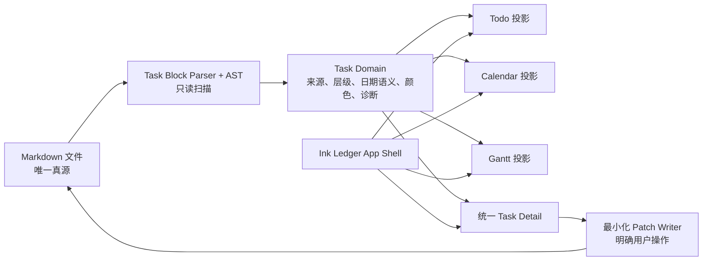

# Ink Ledger UI 重构落地计划

> **状态**：实施蓝图 v1.0。本文不修改 `src`，供核心任务语义重构稳定后执行。  
> **前提**：Markdown 是唯一真源；只有显式 `<!-- mdw:tasks ... -->` Task Block 中的合法任务可被 Todo / Calendar / Gantt 投影。任何 UI 改造都不得恢复“全文扫描 `- [ ]`”或自动写回的行为。

---

## 1. 范围、约束与成功定义

### 1.1 本次 UI 重构的范围

- 建立以 `墨线工作台 / Ink Ledger` 为核心的桌面优先 App Shell；
- 将笔记、Todo、Calendar、Gantt 变为同一任务领域的不同可追溯投影；
- 增加统一任务详情检查器、命令面板、空状态、诊断与保存/冲突反馈；
- 将现有扁平 CSS 拆为 tokens / layout / primitives / feature styles；
- 提供完整深浅主题、移动端降级、键盘与屏幕阅读器支持；
- 替换当前 emoji 图标为统一 SVG（推荐 Lucide Vue，或本地封装的同一图标集）。

### 1.2 明确不在 UI 阶段偷偷做的事

- 不自动把普通 checklist 包进 Task Block；
- 不在扫描、打开笔记、切视图时补 `@id`、修日期或写文件；
- 不将 `@due` 显示/保存为 `@end`；
- 不因做甘特拖拽而绕过最小化 patch writer；
- 不将未实现的 WYSIWYG 往返保真说成“无损 Markdown 编辑”；
- 不把依赖关系、提醒、重复任务、多人协作作为 v1 UI 的隐含范围。

### 1.3 成功定义

用户能在任一视图看见相同任务身份（标题、颜色、状态、日期语义、来源），打开详情后理解“此项写自哪个 Task Block / 哪一行 Markdown”，并能在不丢未知语法的前提下完成受支持字段修改。首次使用没有强制模板和突兀标题；数据为空时说明规则与下一步，不暗中创建内容。

---

## 2. 现状审查（权威源码）

审查目录：`C:\Users\Zebra\Documents\Codex\2026-07-19\ztoolscenter-ztools-https-github-com-ztoolscenter\work\md-workspace`

| 现有位置 | 发现 | 重构方向 |
|---|---|---|
| `src/App.vue` | 只有 Sidebar + TopBar + 单一 content pane；视图以条件分支切换。全局快捷键已有基础，但缺少命令面板、focus mode 和弹层层级管理。 | 改为 App Shell，接纳 workspace rail、library、canvas、inspector；保留快捷键能力并重构为 command registry。 |
| `src/styles/main.css` | 约 2300 行单文件，组件/主题/响应式规则交错；已存在浅深 token 雏形，但没有 token 层、z-index 与状态系统。 | 分拆并以 `ui-design-system.md` 的命名创建 tokens、base、layout、primitives、features。 |
| `src/components/TopBar.vue` | 当前笔记标题、视图切换、模式切换、保存、设置全部挤在一行；以文字/emoji 图标为主。 | 拆为 ProductBar + ContextBar + ViewNavigation；保存状态变为可读的写入状态。 |
| `src/components/NoteSidebar.vue` | 品牌、最近、文件夹、搜索、onboarding、创建动作混杂；onboarding 文案仍认为 `- [ ]` 都会入任务投影。 | 拆出 WorkspaceRail 和 NoteLibrary；纠正文案；新增外部冲突/dirty 状态。 |
| `src/views/EditorView.vue` | Source 与 contenteditable WYSIWYG 同处；工具条是文字按钮；空状态提供“新建今日计划”，可能制造默认计划文档。 | 用 EditorCanvas + EditorToolbar + OutlineInspector；source 是保真路径，结构化编辑在能力边界内实施。 |
| `src/views/TodoView.vue` | 同时聚合今日、逾期、无日期；新增路径隐含写入“今日计划”。 | 重构为 Inbox / Today / Upcoming / All；所有新增必须先选择 Task Block。 |
| `src/views/CalendarView.vue` | 月格+点击快捷新增；日历项和详情为页面内局部面板。 | 重构为 Calendar toolbar、agenda sheet、统一 TaskDetailInspector；区分 date / due / range / milestone。 |
| `src/views/GanttView.vue` | 仅扁平跨日条和日期 input；点击/拖拽与删除分散在视图；无缩放、分组、里程碑、诊断。 | 重构为 TaskTree + Timeline，并依赖统一详情和最小 patch 回写。 |
| `src/components/SettingsPanel.vue` | 设置、快捷键说明和同步信息已存在，但主题只有“跟随系统”描述。 | 追加 Theme、布局偏好、快捷键/可访问性设置；保留本地同步说明。 |
| `src/core/types.ts` | 旧模型仅 id/title/done/start/end/tags，不能表达 block、层级、due、date、颜色与来源范围。 | UI 实施必须等待 Task domain 扩展；不能用 `any` 在视图中补语义。 |

---

## 3. 目标组件图与数据边界



**UI 不拥有第二份任务真相**。局部组件最多持有 filter、选择状态、可取消的表单 draft 和 view preference；提交后必须等待最小化 patch writer 的结果。所有任务定位键使用稳定 `task.id + notePath + blockId`，不以显示标题作标识。

---

## 4. 分期实施与依赖

### Phase 0 — 语义接口冻结（阻塞 UI 编码）

**依赖**：核心团队先完成 Task Block parser、AST、LocalDate、诊断和最小 patch writer。

交付给 UI 的最小接口：

```ts
type TaskViewModel = {
  id: string
  blockId: string
  notePath: string
  noteName: string
  sourceRange: { startLine: number; endLine: number }
  headingPath: string[]
  parentId?: string
  childIds: string[]
  depth: number
  title: string
  done: boolean
  type: 'group' | 'task' | 'milestone'
  date?: LocalDate
  due?: LocalDate
  start?: LocalDate
  end?: LocalDate
  priority?: 'low' | 'medium' | 'high' | 'urgent'
  color?: 'gray' | 'blue' | 'green' | 'orange' | 'red' | 'violet'
  tags: string[]
  diagnostics: TaskDiagnostic[]
}
```

必须另提供：

- `createTask({ targetBlockId, ... })`：没有 `targetBlockId` 必须拒绝；
- `patchTask(taskRef, patch)`：返回成功、冲突、验证错误、写入错误之一；
- `openTaskSource(taskRef)`：定位笔记和行；
- `listTaskBlocks(scope)` 与 `createTaskBlock(notePath, metadata)`：仅由用户明确触发；
- 避免 `Date.toISOString()` 参与显示与 Task domain，统一 LocalDate。

**UI 验收门**：普通文档、fenced code、未闭合块、重复 ID、非法日期在 UI 中可解释但不自动修正。

### Phase 1 — 建立视觉基础与 App Shell

**目标**：先统一空间、token 和导航，不改变任务回写路径。

1. 新增样式层（建议）：
   - `src/styles/tokens.css`：深浅主题、spacing、type、z-index、motion、task colors；
   - `src/styles/base.css`：reset、字体、focus、reduced-motion、scrollbar；
   - `src/styles/layout.css`：App Shell、rail、library、canvas、inspector、breakpoints；
   - `src/styles/primitives.css`：button、icon button、input、menu、badge、empty、toast、dialog；
   - `src/styles/features.css`：editor/todo/calendar/gantt/task inspector 的业务样式；
   - `src/styles/main.css`：仅作为 imports 或最终移除。迁移中不可同时保留冲突 selector。
2. 新组件：
   - `src/components/AppShell.vue`
   - `src/components/WorkspaceRail.vue`
   - `src/components/ProductBar.vue`
   - `src/components/ContextBar.vue`
   - `src/components/NoteLibrary.vue`
   - `src/components/InspectorPanel.vue`
3. 修改：
   - `src/App.vue`：组合 AppShell、视图和全局 transient layer；不再直接固定 `NoteSidebar`/`TopBar`。
   - `src/main.ts`：引入拆分后的样式入口。
   - `src/composables/useWorkspace.ts`：仅新增可持久化的 UI layout preference（不是任务数据）。
4. 迁移当前组件：
   - `NoteSidebar.vue` 先拆/改名为 `NoteLibrary.vue`；如需渐进迁移，保持一个短期 re-export，完成后删除。
   - `TopBar.vue` 拆为 ProductBar/ContextBar；不要让两个顶栏重复显示标题。

**验收**：1440 / 1180 / 1024px 无重叠；可收起 library/inspector；主题全局生效；原有编辑、保存、视图切换仍可运行。

### Phase 2 — 编辑器与文档上下文

**目标**：让 Markdown 书写成为视觉中心，并显式标识任务块与保真边界。

1. 新组件建议：
   - `src/components/EditorToolbar.vue`
   - `src/components/DocumentOutline.vue`
   - `src/components/TaskBlockHeader.vue`
   - `src/components/SaveStatus.vue`
   - `src/components/DiagnosticsList.vue`
2. 修改 `src/views/EditorView.vue`：
   - 分为 `EditorEmptyState`、`EditorToolbar`、`SourceEditor`、`StructuredEditor`；
   - 删除 “新建今日计划” 作为首要空状态，改为 “新建笔记 / 查看任务块示例”；
   - source mode 做到清晰、稳定、可访问；结构化模式在安全能力前不做全量 turndown round-trip；
   - Task Block header 从 AST 渲染；普通 checklist 绝不出现计划徽章。
3. 修改 `src/core/markdownBridge.ts`（安全阶段）：
   - 在 UI 提供阅读/结构化渲染前，明确 sanitization 策略与恶意 HTML / `javascript:` URL 测试；
   - 不达标时用 source-only 或严格的只读预览替代。

**验收**：H1–H3 大纲、诊断、保存状态、LocalDate 和焦点状态正确；编辑器 200% 缩放可用；普通 checkbox 不被标记。

### Phase 3 — 统一任务详情与创建路径

**目标**：只建立一个编辑任务属性的地方，消除三个视图的散乱写入 UI。

1. 新组件：
   - `src/components/tasks/TaskRow.vue`
   - `src/components/tasks/TaskTree.vue`
   - `src/components/tasks/TaskDetailInspector.vue`
   - `src/components/tasks/TaskBlockPicker.vue`
   - `src/components/tasks/TaskMetaList.vue`
   - `src/components/tasks/TaskStatusIcon.vue`
2. 新 composable：
   - `src/composables/useTaskSelection.ts`：当前 task ref、source 跳转、跨视图同步选择；
   - `src/composables/useTaskDraft.ts`：字段 draft、校验、dirty guard、提交/失败状态；不缓存源数据为真相；
   - `src/composables/useCommandRegistry.ts`：注册快捷键和命令，不让 `App.vue` 继续堆 if 分支。
3. 重要交互：
   - 点击任何 task 仅设置 selection 并打开 inspector；
   - `新建任务` 必经 TaskBlockPicker；没有块时引导创建块，取消无文件写入；
   - 修改前显示最小 patch 摘要；校验失败留在 draft；冲突不覆盖源文件；
   - `定位到原文` 打开正确 note 并滚动至 `sourceRange`。

**验收**：A13/A14/A20/A21 对应交互可以在 UI 测试中观察到；due、date、range 不混写；选中状态跨视图一致。

### Phase 4 — Todo 投影

**目标**：兑现 Inbox / Today / Upcoming / All，并支持层级与来源。

修改 `src/views/TodoView.vue`，建议拆出：

- `src/components/todo/TodoToolbar.vue`
- `src/components/todo/TodoGroup.vue`
- `src/components/todo/TodoComposerTrigger.vue`

实现要求：

- query 层根据统一 Task domain，按日期语义分组；不再使用 `today + overdue + undated` 的单一混合筛选；
- Inbox 仅未排期任务；Today 不含无日期任务；Upcoming 保留 due/date/range 文案；All 以 note / block / heading 分组；
- 父子树使用 TaskTree，完成父项不级联；
- 现有 inline 快速添加改成 `TodoComposerTrigger`，打开统一创建流程；
- 包含来源、优先级、颜色、标签的可读 meta，控制密度，避免标签云淹没标题。

**验收**：同一任务在 Todo 与 Inspector 显示相同元数据；无日期只在 Inbox；打开来源不丢当前筛选偏好。

### Phase 5 — Calendar 投影

修改 `src/views/CalendarView.vue`，建议拆出：

- `src/components/calendar/CalendarToolbar.vue`
- `src/components/calendar/MonthGrid.vue`
- `src/components/calendar/WeekAgenda.vue`
- `src/components/calendar/DayAgendaSheet.vue`
- `src/components/calendar/CalendarItem.vue`

实现要求：

- Month 与 Week 两种结构；桌面月格、小屏 agenda；
- `@date`、`@due`、range、milestone 各有形状、文案、aria-label；
- 每日超过 3 项用 `+N 项`，点击开 Sheet；
- 点击空白日期只预填日期并打开 TaskBlockPicker，不直接落盘；
- P1 拖拽前先完成 keyboard 可替代的字段编辑；拖放后 Toast 说明改动的字段名。

**验收**：A16/A17/A19 的可见语义及 LocalDate 通过；月份切换不会靠 UTC 导致一天偏移。

### Phase 6 — Gantt 投影

修改 `src/views/GanttView.vue`，建议拆出：

- `src/components/gantt/GanttToolbar.vue`
- `src/components/gantt/GanttTaskTree.vue`
- `src/components/gantt/GanttTimeline.vue`
- `src/components/gantt/GanttBar.vue`
- `src/components/gantt/GanttDiagnostics.vue`

实现要求：

- 任务树和时间轴双滚动同步；表头/左列 sticky；分组可折叠；
- 按日/周/月缩放，时间轴 label 使用 tabular number；
- 条、group、milestone 的几何不同，颜色来自 task color；今天线、周末背景和 tooltip 均有非色彩表达；
- 非法/无范围任务进入诊断列表，不伪造时间条；
- P1 再添加 pointer drag 和 resize；先实现 Inspector 日期编辑与键盘替代。

**验收**：合法 `start < end` 才显示条；milestone 显示菱形；单日 task 不显示 Gantt 条；拖动失败/冲突可见且回退。

### Phase 7 — 命令、设置、无障碍与移动收尾

新增/修改：

- `src/components/CommandPalette.vue`
- `src/components/ShortcutHelp.vue`
- `src/composables/useHotkeys.ts`
- `src/components/SettingsPanel.vue`
- `src/components/ConfirmDialog.vue`、`src/components/PromptDialog.vue`（统一 modal 焦点管理和 tokens）

收尾任务：

- 将现有 `App.vue` 中 global keydown 逻辑迁到 command registry，避免在输入框、日期控件、modal 内误拦截；
- Settings 支持 theme（system/light/dark）、布局偏好、减少动效、快捷键列表；
- 小屏左/右 Sheet、底部导航、Calendar agenda、Gantt 列表替代；
- 全面替换 emoji（`⚙`、`📁`、`📂` 等）为 SVG；
- 提供 Toast/live region、focus trap、Esc/焦点返回、reduced-motion、44px touch target。

---

## 5. 文件级落地映射

| 文件 | 动作 | 责任与边界 |
|---|---|---|
| `src/App.vue` | 重构 | 只负责应用组合、provider、全局 command / modal / toast 层；不包含视图业务计算。 |
| `src/main.ts` | 修改 | 统一样式入口、主题初始化；防止首次主题闪烁。 |
| `src/styles/main.css` | 拆分 / 降级为入口 | 避免继续增长为 2000+ 行单文件。 |
| `src/styles/tokens.css` | 新增 | 文档所列全局 token；深浅主题与任务语义色。 |
| `src/styles/base.css` | 新增 | reset、字体、focus、a11y、reduced motion。 |
| `src/styles/layout.css` | 新增 | App shell、三/四栏布局、断点、Sheet。 |
| `src/styles/primitives.css` | 新增 | 按钮、输入、菜单、modal、toast、empty state。 |
| `src/styles/features.css` | 新增 | editor、task、todo、calendar、gantt 特有样式。 |
| `src/components/TopBar.vue` | 拆分/替换 | 迁至 ProductBar 与 ContextBar 后删除旧职责。 |
| `src/components/NoteSidebar.vue` | 拆分/替换 | 迁至 WorkspaceRail + NoteLibrary；纠正 Task Block 文案。 |
| `src/components/SettingsPanel.vue` | 修改 | 主题、布局、动效、快捷键说明与无障碍偏好。 |
| `src/components/ConfirmDialog.vue` | 修改 | 原生语义、focus trap、危险状态 token、焦点返回。 |
| `src/components/PromptDialog.vue` | 修改 | 同上，加入 label / error / draft guard。 |
| `src/views/EditorView.vue` | 重构 | 渲染 editor canvas；保真模式边界和 Task Block 表现。 |
| `src/views/TodoView.vue` | 重构 | 只渲染 Todo projection；新增经 task picker。 |
| `src/views/CalendarView.vue` | 重构 | Month/Week/agenda，日期语义；不直接绕过 writer。 |
| `src/views/GanttView.vue` | 重构 | tree + timeline + diagnostics；P1 后才拖拽。 |
| `src/core/types.ts` | 先由核心改 | UI 等待统一 Task domain；禁止 UI 持有临时 any 语义。 |
| `src/core/parseTasks.ts` | 先由核心改 | 只对合法 Task Block 产出 AST/diagnostics。 |
| `src/core/writeTasks.ts` | 先由核心改 | 提供最小 patch、保留 unknown metadata 与格式。 |
| `src/core/markdownBridge.ts` | 安全改造 | 结构化/预览渲染必须 sanitization；保持 Markdown 保真策略透明。 |
| `src/composables/useWorkspace.ts` | 修改 | 管理 layout/view preference、active note、保存/冲突状态；去除自动写 ID。 |

> 组件文件名是建议，可按项目现有命名调整；核心约束是职责边界，不能将样式、领域计算、回写逻辑重新塞入单个 `.vue` 文件。

---

## 6. 实施顺序与 PR/提交切分建议

因仓库当前不是 Git，执行前应先将权威 C 盘源码纳入可恢复的版本控制或至少完整备份。若后续建立 Git，建议按下列粒度提交；不要把核心解析、UI 换皮、拖拽交互混在一次变更中。

1. `docs(ui): define ink ledger design system and rollout plan`（本次文档）
2. `feat(ui): introduce tokens and responsive app shell`
3. `refactor(editor): separate source editor and document context UI`
4. `feat(tasks-ui): add shared task inspector and task block picker`
5. `refactor(todo): project task domain into inbox today upcoming all`
6. `feat(calendar): add semantic month and week projections`
7. `feat(gantt): add tree timeline and schedule diagnostics`
8. `feat(ui): add command palette settings and accessibility polish`

每一步必须在权威 C 盘目录验证，再由既有发布流程（如 `apply-to-D.ps1`）同步至 D 盘安装副本；禁止手工只改 D 盘造成漂移。

---

## 7. 测试与验收计划

### 7.1 自动化

| 层 | 最小验证 |
|---|---|
| 核心 | 扩展 `src/core/task.test.ts`、`globalTasks.test.ts`，覆盖 Task Block、层级、date/due/range/milestone、诊断与最小 patch。 |
| 组件 | 引入 Vue Test Utils / Vitest 后，测试 TaskRow、TaskDetail、TaskBlockPicker 的状态、禁用与事件。 |
| 可访问性 | 引入 axe 或等价测试；至少覆盖 AppShell、modal、TaskDetail、Calendar item。 |
| 构建 | `npm run test:core`、`npm run build`。 |
| 视觉 | 1440×900、1180×800、1024×768、768×1024、375×812 的 Home / Editor / Todo / Calendar / Gantt 深浅主题截图回归。 |

### 7.2 手动冒烟矩阵

1. 空 workspace 打开后，没有自动生成“本周计划”；能新建自己的笔记。
2. 普通 Markdown `- [ ]` 与代码围栏 checkbox 不会出现在 Todo/Calendar/Gantt。
3. 同一 Task Block 任务在三视图与 Inspector 一致；`定位到原文` 精确定位。
4. 新建任务必选 Task Block；取消、无块、解析错误都不写入。
5. `@date`、`@due`、range、milestone 在 Calendar 的形状/文案正确；Gantt 只收合法范围与 milestone。
6. 无日期任务只在 Inbox；Today 包含今天、跨日进行项、逾期 due，且分组清楚。
7. 主题切换、系统主题、减少动效、200% 缩放、键盘导航、读屏状态都可用。
8. 写入失败和外部改动冲突不静默覆盖，用户可见下一步。
9. 移动端能打开笔记库、创建任务、编辑日期、查看来源；没有应用级横向滚动。

### 7.3 视觉质量闸门

- 所有点击项 hover/focus 清晰、`cursor: pointer` 正确、过渡 120–240ms；
- 不用 emoji 作 UI 图标，所有 icon button 有 `aria-label`；
- 浅色正文/辅助文字、深色正文/辅助文字均达到对比要求；
- 无透明玻璃卡片在浅色中失去边界；
- 甘特的条/日历的日期语义不只靠颜色；
- 没有内容被固定栏遮住，移动端触摸目标不少于 44px。

---

## 8. 风险与控制

| 风险 | 后果 | 控制 |
|---|---|---|
| 先换皮后重构数据模型 | UI 仍将普通 checklist 当任务，返工巨大 | Phase 0 为硬依赖，UI 不模拟任务语义。 |
| contenteditable 全量 Markdown 往返 | 格式/未知 metadata 丢失甚至 XSS | 以 source 为保真模式；安全渲染后才渐进开放结构化编辑。 |
| 甘特拖拽先行 | 易将 due/date/range 混写 | P1 后实施；先完成 Inspector 字段编辑与 writer 测试。 |
| 大量拆组件导致功能回归 | 保存/打开/宿主插件生命周期失效 | 每 Phase 保留运行检查，针对 `ztools` enter/out 做冒烟。 |
| C/D 副本再次漂移 | 用户看到的版本不是验证版本 | C 盘权威路径开发、测试、提交/打包后只走同步脚本。 |
| 视觉只在宽屏成立 | 平板/手机不可用 | 每 Phase 以断点截图和 keyboard/touch 验收为门槛。 |

---

## 9. 执行前 Checklist

- [ ] 核心 Task Block 解析与 patch writer 已按产品规格通过 A01–A12。
- [ ] 统一 Task domain 已提供 block、sourceRange、headingPath、层级、date/due/start/end/type/priority/color/diagnostics。
- [ ] 确认权威开发目录为 C 盘路径，D 盘为发布副本。
- [ ] 使用版本控制或创建可验证备份后再大规模拆 CSS / 组件。
- [ ] 为 `ztools` 宿主生命周期保留手动测试入口。
- [ ] 明确图标来源与许可（推荐 Lucide Vue）；不引入未经审查的大型 UI 框架。
- [ ] 将 `docs/ui-design-system.md` 作为实现时的 token/组件/可访问性验收依据。
